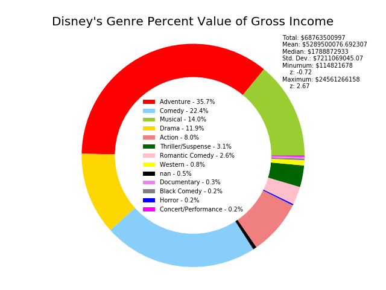
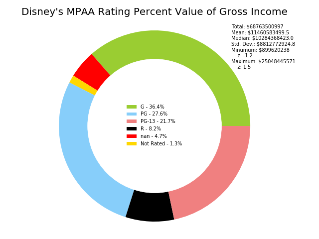

# Overview
In this research, it was found that the best movie genre for Disney to produce is **Adventure**.  The best movie rating for Disney to produce is **G**.  When referring to the *value* of something, I am referring to the mean of a variable such as the mean gross of a certain genre.

The best movies for Disney to produce are **Adventure** movies with a rating of **G**.

## Genre

The *Adventure* genre makes up **35.7%** of the value of each Disney movie genre with *Comedy* coming next with **22.4%** and *Musical* in third with **14%**.
The total value of genres is $68,763,500,997 with a mean of $5,289,500,076.7 and a standard deviation of $7,211,069,045.1.  Adventure genre has a value of $24,561,266,158 being 2.67 standard deviations above the mean.

## MPAA Rating

The *G* rating makes up **36.4%** of the value of each Disney movie genre with *PG* coming next with **27.6%** and *PG-13* in third with **21.7%**.
The total value of movies is $68,763,500,997 with a mean of $11,460,583,499.5 and a standard deviation of $8,812,772,924.85.  G MPAA rating has a value of $25,048,445,571 being 1.54 standard deviations above the mean.