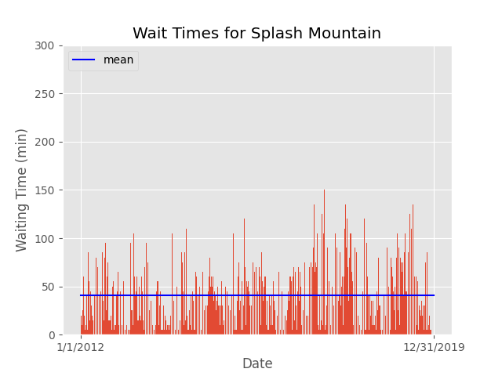
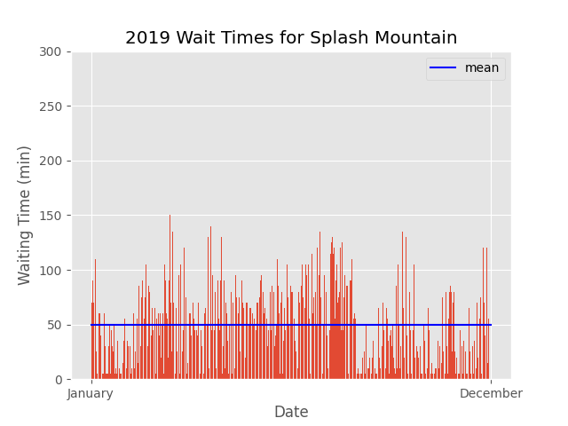
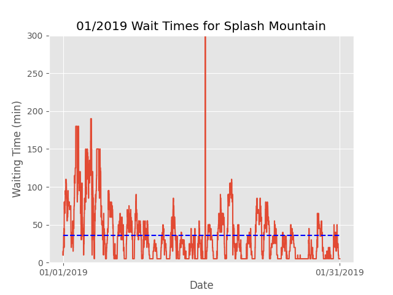
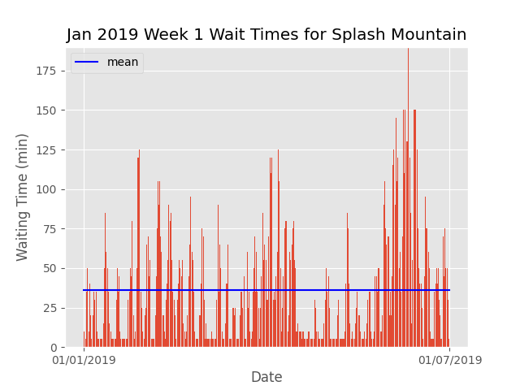
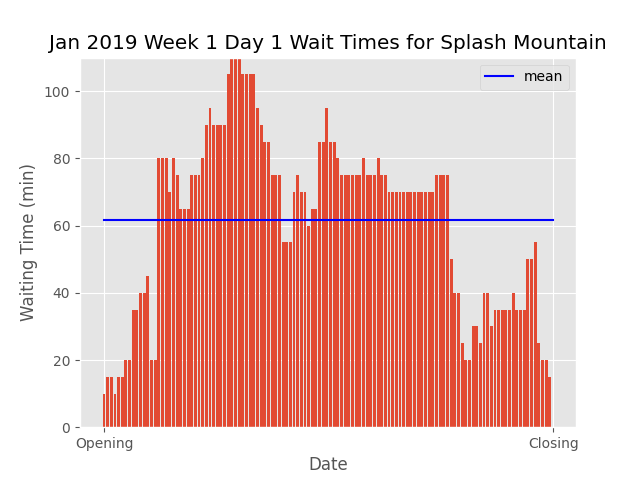

# Overview
In this research, many plots were created to visualize the data.  The overall point of these reports were to visualize the average wait times on variable time intervals over many differnt Disney Park rides.

Dataset obtained from [Touring Plans](https://touringplans.com/walt-disney-world/crowd-calendar#DataSets)

## Sample Ride Report (Splash Mountain)

The *Master Wait Times* plot shows the average wait times from January 1, 2012 through December 31, 2019 with the mean over the time interval.

The *2019 Wait Times* plot shows the average wait times in the year 2019 with the mean over the time interval.

The *2019 Month 1 Wait Times* plot shows the average wait times in January of 2019 with the mean over the time interval.

The *2019 Month 1 Week 1 Wait Times* plot shows the average wait times of the first week in January of 2019 with the mean over the time interval.

The *2019 Month 1 Week 1 Day 1 Wait Times* plot shows the average wait times of the first day in the first week of January of 2019 with the mean over the time interval.
